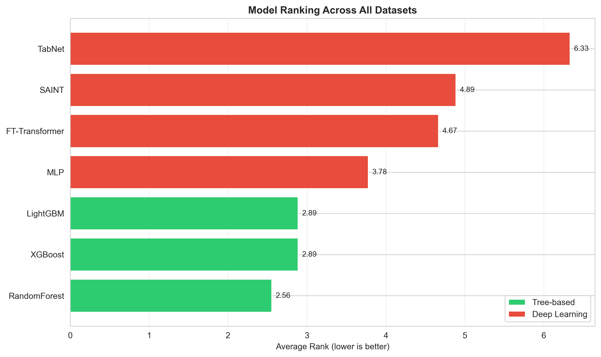
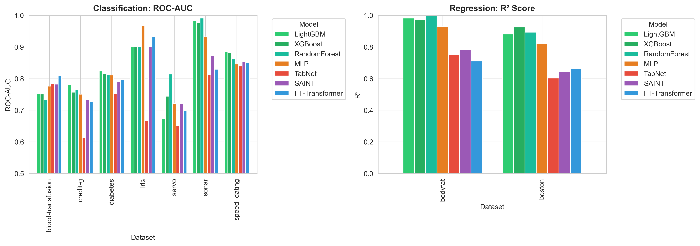
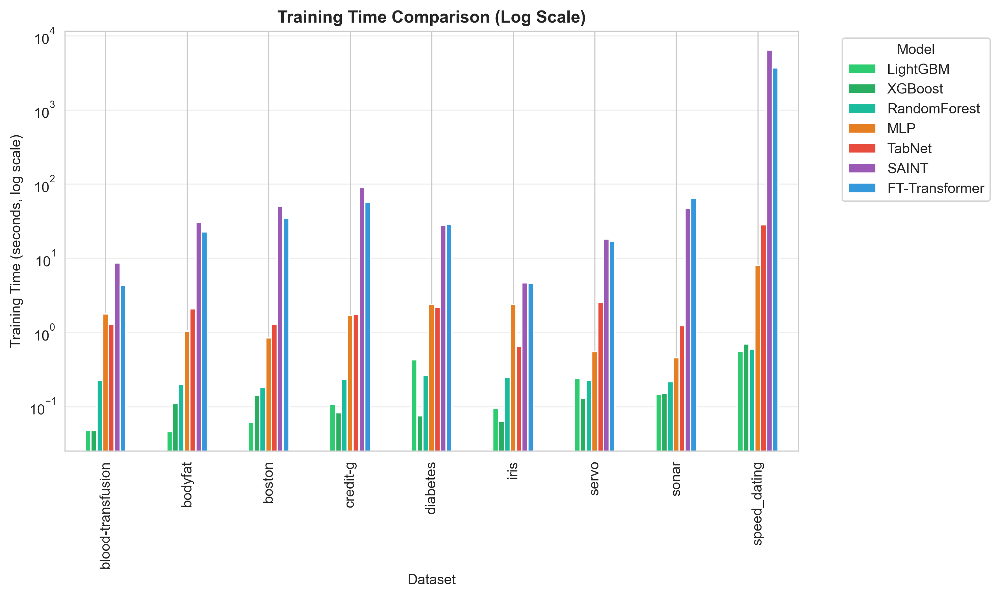


# Tabular Benchmark: Tree-Based Models vs. Deep Learning

Companion code to my EPFL Bachelor semester project, *"Machine Learning Models on Tabular Data"* (2024–2025, supervised by Can Yang, EPFL / HKUST). The written report develops the mathematical theory behind seven widely-used tabular ML models and uses this codebase to benchmark them empirically. The results replicate, at a smaller scale, the central finding of [Grinsztajn, Oyallon & Varoquaux (2022)](https://arxiv.org/abs/2207.08815): **tree-based models remain state-of-the-art on medium-sized tabular data**, and outperform even architectures purpose-built for it.

## What this project does

1. **Implements seven models from scratch or via sklearn-style wrappers** — three tree-based (Random Forest, XGBoost, LightGBM) and four deep learning (MLP, TabNet, FT-Transformer, SAINT) — behind a single, consistent `fit` / `predict` / `evaluate` interface.
2. **Benchmarks all seven** across nine standard classification and regression datasets from OpenML/UCI, spanning 150 to 8,378 samples and 4 to 120 features.
3. **Measures both predictive performance** (ROC-AUC / R²) **and training time**, then visualizes the performance–efficiency trade-off.

## Models

| Model | Type | Notes |
|---|---|---|
| Random Forest | Tree-based | Bagged CART ensemble ([Breiman, 2001](https://doi.org/10.1023/A:1010933404324)) |
| XGBoost | Tree-based | Regularized gradient boosting with derived optimal leaf weights ([Chen & Guestrin, 2016](https://arxiv.org/abs/1603.02754)) |
| LightGBM | Tree-based | Leaf-wise boosting with GOSS + Exclusive Feature Bundling ([Ke et al., 2017](https://papers.nips.cc/paper/6907-lightgbm-a-highly-efficient-gradient-boosting-decision-tree)) |
| MLP | Deep learning | Two hidden layers (128, 64), ReLU, Adam, early stopping |
| TabNet | Deep learning | Sequential attentive feature selection via sparsemax masks ([Arik & Pfister, 2021](https://arxiv.org/abs/1908.07442)) |
| FT-Transformer | Deep learning | Per-feature tokenization + Transformer encoder ([Gorishniy et al., 2021](https://arxiv.org/abs/2106.11959)) |
| SAINT | Deep learning | Adds intersample (row-wise) attention on top of FT-Transformer ([Somepalli et al., 2021](https://arxiv.org/abs/2106.01342)) |

The full derivations (CART splitting criteria, the Random Forest bias–variance decomposition, XGBoost's optimal leaf weights and split gain, LightGBM's GOSS/EFB, and the attention mechanisms behind TabNet/FT-Transformer/SAINT) are worked out in the written report; this code is the empirical half of that project.

## Datasets

| Dataset | Task | Source | Samples | Features |
|---|---|---|---|---|
| blood-transfusion | Classification | UCI/OpenML | 748 | 4 |
| credit-g | Classification | OpenML | 1,000 | 20 |
| diabetes | Classification | OpenML | 768 | 8 |
| iris | Classification | UCI | 150 | 4 |
| servo | Classification | UCI | 167 | 4 |
| sonar | Classification | UCI | 208 | 60 |
| speed_dating | Classification | Kaggle/OpenML | 8,378 | 120 |
| bodyfat | Regression | UCI | 252 | 14 |
| boston | Regression | UCI | 506 | 13 |

All datasets are loaded directly from OpenML at runtime via `data_loader.py` — nothing is stored in the repo. A stratified 80/20 train/test split is used throughout; numerical features are standardized and categorical features are encoded per-model.

## Results

**Overall ranking.** Average rank across all nine datasets (lower is better; ROC-AUC for classification, R² for regression):



Random Forest (2.56), XGBoost and LightGBM (2.89 each) take the top three spots. MLP is the strongest deep learning model (3.78) — ahead of both FT-Transformer (4.67) and SAINT (4.89), despite their tabular-specific attention mechanisms. TabNet is the weakest model overall (6.33).

**Per-dataset performance.**



**Training time.** Tree-based models train in well under a second on every dataset regardless of size; SAINT and FT-Transformer take minutes and don't close the accuracy gap in exchange:



**Performance vs. training time trade-off**, per dataset:



### Key findings

Tree-based models dominate on both accuracy and speed — Random Forest, XGBoost, and LightGBM occupy the top three ranks and train 10–100× faster than any deep learning baseline. Among the neural approaches, a plain MLP outperforms both attention-based, tabular-specific architectures (FT-Transformer, SAINT), and TabNet — designed specifically for tabular data — is the weakest model tested. Tree-based training time is essentially flat as dataset size grows, while SAINT and FT-Transformer scale super-linearly (their intersample and feature-token attention scale with batch size and feature count respectively), so the efficiency gap widens rather than narrows as data grows. These results are consistent with the three inductive-bias hypotheses of Grinsztajn et al. (2022): tabular targets tend to be irregular and non-smooth (favoring piecewise-constant tree splits over the low-frequency bias of neural nets), tabular datasets carry many uninformative features (penalizing rotationally-invariant learners like MLPs), and each column carries individual semantic meaning that a neural network's first linear layer tends to mix away.

## Project structure

```
├── data_loader.py               # OpenML dataset loading, preprocessing, train/test split
├── benchmark.py                 # Benchmark class: trains/evaluates all models on one dataset
├── run_simple_benchmark.py      # Runs the full benchmark across all 9 datasets
├── visualize_results.py         # Generates the plots in figures/
├── models/
│   ├── tree_models.py           # RandomForest, XGBoost, LightGBM
│   └── deep_models.py           # MLP, TabNet, FT-Transformer, SAINT
├── figures/                     # Output plots (checked in — see Results above)
├── requirements.txt
├── environment.yaml
└── LICENSE
```

## Quick start

```bash
# 1. Create environment
conda create -n tabular_benchmark python=3.12
conda activate tabular_benchmark

# 2. Install dependencies
pip install -r requirements.txt
# For a CUDA build of torch, see the note in environment.yaml

# 3. Run the full benchmark (all 9 datasets, all 7 models)
python run_simple_benchmark.py

# 4. Regenerate the figures from the results
python visualize_results.py
```

### Running a single dataset

```python
from benchmark import Benchmark

bm = Benchmark(dataset_name="credit-g")   # or dataset_id=<openml_id>
results = bm.run_all()                     # trains + evaluates all 7 models
bm.print_summary()
bm.save_results("credit_g_results.json")
```

Or from the command line:

```bash
python benchmark.py --dataset credit-g --output credit_g_results.json
```

## Extending the benchmark

- **New model**: add a class to `models/tree_models.py` or `models/deep_models.py` exposing `fit`, `predict`, and `evaluate`, then register it in `benchmark.py`'s `run_tree_models` / `run_deep_models`.
- **New dataset**: add an entry to `DATASETS` in `run_simple_benchmark.py` (by OpenML `dataset_id` or `name`).

## References

1. Breiman, L. *Random Forests*. Machine Learning, 2001.
2. Chen, T., & Guestrin, C. *XGBoost: A Scalable Tree Boosting System*. KDD 2016.
3. Ke, G. et al. *LightGBM: A Highly Efficient Gradient Boosting Decision Tree*. NeurIPS 2017.
4. Arik, S. Ö., & Pfister, T. *TabNet: Attentive Interpretable Tabular Learning*. AAAI 2021.
5. Gorishniy, Y. et al. *Revisiting Deep Learning Models for Tabular Data*. [arXiv:2106.11959](https://arxiv.org/abs/2106.11959), 2021.
6. Somepalli, G. et al. *SAINT: Improved Neural Networks for Tabular Data via Row Attention and Contrastive Pre-Training*. [arXiv:2106.01342](https://arxiv.org/abs/2106.01342), 2021.
7. Grinsztajn, L., Oyallon, E., & Varoquaux, G. *Why do tree-based models still outperform deep learning on tabular data?* [arXiv:2207.08815](https://arxiv.org/abs/2207.08815), 2022.
8. Shwartz-Ziv, R., & Armon, A. *Tabular Data: Deep Learning is Not All You Need*. [arXiv:2106.03253](https://arxiv.org/abs/2106.03253), 2021.
9. Vanschoren, J. et al. *OpenML: Networked science in machine learning*. SIGKDD Explorations, 2014.

## Author

Adrien de Botton — EPFL Bachelor in Mathematics, incoming Yale MS in Statistics and Data Science.

## License

MIT — see [LICENSE](LICENSE).
